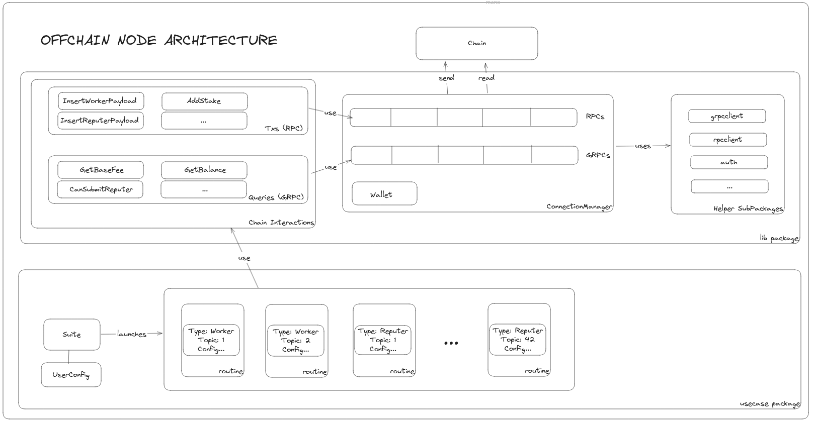

# allora-offchain-node

Allora off-chain nodes publish inferences, forecasts, and losses informed by a configurable ground truth and applying a configurable loss function to the Allora chain.

> **Chain compatibility:** this node targets the **v10** Allora chain emissions API and requires a chain that has run the v10 upgrade. It is **not** backward-compatible with v9 chains — in particular the reputer path consumes v10-only network-inference bundles, and labeled (multi-label) submissions depend on v10 topic arity. Make sure the chain you point the node at is on v10 (matching the `allora-chain` version pinned in `go.mod`).

## How to run with docker
1. Clone the repository
2. Make sure to remove any .env file so it doesn't clash with the automated environment variables
3. Copy config.example.json and populate with your variables. You can either populate with your existing wallet or leave it empty for it to be auto-created

```shell
cp config.example.json config.json
```
4. Run the command below to load your config.json file to the environment

```shell
chmod +x init.config
./init.config
```

from the root directory. This will:
   - Load your config.json file into the environment. Depending on whether you provided your wallet details or not, it will also do the following:
      - Automatically create allora keys for you. You will have to get tokens (if testnet, you can request from the faucet) to be able to register your worker and stake your reputer. You can find your address in ./data/env_file
      - Automatically export the needed variables from the account created to be used by the offchain node and bundle them with your provided config.json and then pass them to the node as environment variables

5. Run `docker compose up --build`. This will:
   - Run both the offchain node and the source services, communicating through endpoints attached to the internal DNS

Please note that the environment variables will be created as a bundle of your config.json and allora account secrets. Please make sure to remove all secrets before committing to a remote git repository.


## How to run without docker

1. Clone the repository
2. Install Go 1.22.5
3. Install the dependencies:

```shell
go mod download
```

4. Copy environment variables:

```shell
cp .env.example .env
```

5. Configure your wallet, network, etc. values. See [How to configure](#how-to-configure) section.
6. If you're a worker...
   1. Run your inference and/or forecast processes exposing their endpoints, and configure them in `config.json`.
7. If you're a reputer...
   1. Run your ground truth and loss function processes exposing their endpoints, and configure them in `config.json`.
8. Map each topic to the appropriate adapter in `config.json` following the `config.example.json` example.
9. Run the following commands:

```shell
chmod +x start.local
./start.local
```

## Prometheus Metrics

Some metrics are provided in the node. You can access them on port `:2112/metrics`. Here is the following list of existing metrics:

- `allora_worker_inference_request_count`: The total number of times a worker requests inference from source
- `allora_worker_labeled_inference_request_count`: The total number of times a worker requests a labeled (multi-label) inference from source
- `allora_worker_forecast_request_count`: The total number of times a worker requests forecast from source
- `allora_reputer_truth_request_count`: The total number of times a reputer requests truth from source
- `allora_worker_chain_submission_count`: The total number of worker commits to the chain
- `allora_reputer_chain_submission_count`: The total number of reputer commits to the chain
- `allora_application_finished_count`: The total number of application runs finished
- `allora_worker_process_finished_count`: The total number of worker processes finished
- `allora_reputer_process_finished_count`: The total number of reputer processes finished
- `allora_application_started_count`: The total number of applications started
- `allora_grpc_connection_lost_count`: The total number of times the GRPC connection is lost
- `allora_grpc_reconnection_count`: The total number of times the GRPC connection is successfully reconnected  
- `allora_grpc_connection_permanent_failure`: The total number of times the GRPC connection failed permanently
- `allora_actor_tx_error_count`: The total number of errors by error code per actor - useful to monitor particular errors.

> Please note that we will keep updating the list as more metrics are being added. Refer to `metrics/constants.go` for details.

## Architecture



The Offchain Node is currently separated into two main packages:
- __lib__: the Allora Client - this may be eventually separated into the Allora Go SDK to use the client separately
- __usecase__: the particular use case for the Offchain Node, i.e., launching the app, reading user config, and launching routines for workers and reputers as configured per user.

Each routine uses chain interactions to communicate with the chain, by use of RPC (txs) and GRPC (queries) in each case.

## Cycle Example

Visualization of timeline and submission windows for an actor, in this case, a worker. 
Reputers have submission windows too, but they are fixed to be 1 full topic's epoch length.

Example configuration:
* Topic epoch length is 100 blocks
* Topic submission window is 10 blocks
* Near zone is 2 submission windows (20 blocks)

```
                                   Epoch N                                        Epoch N+1
|---------|----------------------------------|-----------------------------------|--------→
Block:    1000                              1100                                1200
          ↑                                  ↑                                   ↑
          Epoch Start                        Epoch End                          Next Epoch End
          (& Submission                      & Next Epoch Start
          Window Start)                      (& Next Submission
                                            Window Start)

Detailed View of Zones (assuming epoch length = 100 blocks):

Block 1000  Block 1010                Block 1080    Block 1100
    |-----------|--------------------------|--------------|
    |←                Far Zone            →|←  Near Zone →|
    |←   SW    →|
(SW = Submission Window)

Zone Breakdown (example numbers):
• Epoch Length: 100 blocks
• Submission Window: 100 blocks (coincides with epoch)
• Near Zone: Last 20 blocks (NUM_SUBMISSION_WINDOWS_FOR_SUBMISSION_NEARNESS * WorkerSubmissionWindow)

-------------------------------
- Full cycle transition points
  - Block 1000: Epoch N starts & Submission Window opens
  - Block 1010: Submission Window closes. Waiting for next window, typically from far zone.
  - Block 1080: Enters Near Zone (more frequent checks)
  - Block 1100: Epoch N ends & Epoch N+1 starts

```

### Notes

- Submissions
  - Submissions are accepted within the submission window
  - Submission window opens at epoch start
- Waiting Zone Behavior
  - The node will wait by subscribing to opening window events 
  - Submissions are separated - they must happen within the submission window

### Jitter

The node introduces a jitter to the submission time to avoid the thundering herd problem, alleviating mempool congestion.

## How to configure

There are several ways to configure the node. In order of preference, you can do any of these: 
* Set the `ALLORA_OFFCHAIN_NODE_CONFIG_JSON` env var with a configuration as a JSON string.
* Set the `ALLORA_OFFCHAIN_NODE_CONFIG_FILE_PATH` env var pointing to a file, which contains configuration as JSON. An example is provided in `config.example.json`.


This is the entrypoint for the application that simply builds and runs the Go program.

It spins off distinct processes per role (worker, reputer) per topic configured in `config.json`.

## Logging env vars

* LOG_LEVEL: Set the logging level. Valid values are `debug`, `info`, `warn`, `error`, `fatal`, `panic`. Defaults to `info`.
* LOG_TIME_FORMAT: Sets the format of the timestamp in the log. Valid values are `unix`, `unixms`, `unixmicro`, `iso8601`. Defaults to `iso8601`.

## Wallet configuration

The wallet configuration is done in `config.json` under the `wallet` field.

### Gas and Fees

Please see detailed information in [gas_and_fees.md](gas_and_fees.md).

### Timeout configuration

The node will use the following timeouts:
* `timeoutRPCSecondsQuery`: Timeout for RPC queries in seconds, including retries.
* `timeoutRPCSecondsTx`: Timeout for RPC sending data in seconds, including retries.
* `timeoutRPCSecondsRegistration`: Timeout for the whole RPC registration process in seconds, including retries.
* `timeoutHTTPConnection`: Timeout for HTTP connection (underlying to the RPC client) in seconds.

### GRPC / RPC connections

From v0.9.0, the node supports multiple GRPC / RPC connections.
GRPC is used for queries, while RPC is used for transactions. At least one GRPC and one RPC node must be provided.
GRPC nodes are configured in the `nodeGrpcs` array in the config.json file.
RPC nodes are configured in the `nodeRpcs` array in the config.json file.

The offchain node (via the `ConnectionManager`) will try to connect to the GRPC/RPC nodes in order of appearance in the array and then switch when appropriate for error handling and spreading the load.

### Error handling

Error handling is done differently for different types of errors.
Note: when an account sequence mismatch is detected, the node will attempt to set the expected sequence number and retry the transaction before broadcasting.
Note: the node will check if the actor is whitelisted on worker setup and before submitting a payload.

#### Retries and Delays

- `accountSequenceRetryDelay`: For the "account sequence mismatch" error.
- `retryDelay`: For all other errors that need retry delays.
- `launchRoutineDelay`: The start of the routine performs many chain interactions. This often triggers "429 Too Many Requests" error. This delay is used to avoid this error, and is set to 10 seconds by default.

### Smart Window Detection

The node will automatically detect the submission window length for each topic on each actor type.
This can be configured by the following settings in the config.json:

* `submissionJitter`: Maximum number of seconds to randomly add to the submission time to avoid the thundering herd problem and reduce mempool congestion. When set to 0, no jitter is applied. Default is 5 seconds.

## Configuration examples

A complete example is provided in `config.example.json`. 
These below are excerpts of the configuration (with some parts omitted for brevity) for different setups:

### 1 worker as inferer 

```json
{
   "worker": [
      {
        "topicId": 1,
        "inferenceEntrypointName": "apiAdapter",
        "parameters": {
          "InferenceEndpoint": "http://source:8000/inference/{Token}",
          "Token": "ETH"
        }
      }
   ]
}
```

### 1 worker as forecaster
```json
{
   "worker": [
      {
        "topicId": 1,
        "forecastEntrypointName": "apiAdapter",
        "parameters": {
          "ForecastEndpoint": "http://source:8000/forecasts/{TopicId}/{BlockHeight}"
        }
      }
   ]
}

```

### 1 worker as inferer and forecaster

```json
{
   "worker": [
      {
        "topicId": 1,
        "inferenceEntrypointName": "apiAdapter",
        "forecastEntrypointName": "apiAdapter",
        "parameters": {
          "InferenceEndpoint": "http://source:8000/inference/{Token}",
          "ForecastEndpoint": "http://source:8000/forecasts/{TopicId}/{BlockHeight}",
          "Token": "ETH"
        }
      }
   ]
}
```

### 1 reputer

```json
{
"reputer": [
      {
        "topicId": 1,
        "groundTruthEntrypointName": "apiAdapter",
        "lossFunctionEntrypointName": "apiAdapter",
        "minStake": "100000000",
        "groundTruthParameters": {
          "GroundTruthEndpoint": "http://localhost:8888/gt/{Token}/{BlockHeight}",
          "Token": "ETHUSD"
        },
        "lossFunctionParameters": {
          "LossFunctionService": "http://localhost:5000",
          "LossMethodOptions": {
            "loss_method": "sqe"
          }
        }
      }
    ]
}
```

### 1 worker as inferer and forecaster, and 1 reputer

```json
{
"worker": [
      {
        "topicId": 1,
        "inferenceEntrypointName": "apiAdapter",
        "forecastEntrypointName": "apiAdapter",
        "parameters": {
          "InferenceEndpoint": "http://source:8000/inference/{Token}",
          "ForecastEndpoint": "http://source:8000/forecasts/{TopicId}/{BlockHeight}",
          "Token": "ETH"
        }
      }
    ],
"reputer": [
      {
        "topicId": 1,
        "groundTruthEntrypointName": "apiAdapter",
        "lossFunctionEntrypointName": "apiAdapter",
        "minStake": "100000000",
        "groundTruthParameters": {
          "GroundTruthEndpoint": "http://localhost:8888/gt/{Token}/{BlockHeight}",
          "Token": "ETHUSD"
        },
        "lossFunctionParameters": {
          "LossFunctionService": "http://localhost:5000",
          "LossMethodOptions": {
            "loss_method": "sqe"
          }
        }
      }
    ]
}
```

### Classification (multi-label) worker and reputer

Some topics are multi-label (e.g. classification), where each submission is a vector of `label:value` pairs instead of a single scalar. Whether a topic is scalar or multi-label is determined by its **on-chain output arity** (`SINGLE` vs `MULTI`), which the node reads at startup — not by which endpoints you configure. For a `MULTI` topic you must configure the labeled endpoints (`LabeledInferenceEndpoint`, `LabeledGroundTruthEndpoint`, `LabeledLossFunctionService`); if the endpoint required for the topic's arity is missing the node fails fast, and any endpoint configured for the other arity is ignored with a warning. See [adapter/api/apiadapter/README.md](adapter/api/apiadapter/README.md) for the labeled request/response formats.

```json
{
"worker": [
      {
        "topicId": 5,
        "inferenceEntrypointName": "apiAdapter",
        "parameters": {
          "LabeledInferenceEndpoint": "http://source:8000/labeled-inference/{Token}",
          "Token": "ETH"
        }
      }
    ],
"reputer": [
      {
        "topicId": 5,
        "groundTruthEntrypointName": "apiAdapter",
        "lossFunctionEntrypointName": "apiAdapter",
        "minStake": "100000000",
        "groundTruthParameters": {
          "LabeledGroundTruthEndpoint": "http://localhost:8888/lgt/{Token}/{BlockHeight}",
          "Token": "ETHUSD"
        },
        "lossFunctionParameters": {
          "LabeledLossFunctionService": "http://localhost:5000/labeled",
          "LossMethodOptions": {
            "loss_method": "sqe"
          }
        }
      }
    ]
}
```

## License

This project is licensed under the Apache 2.0 License - see the [LICENSE](LICENSE) file for details.
